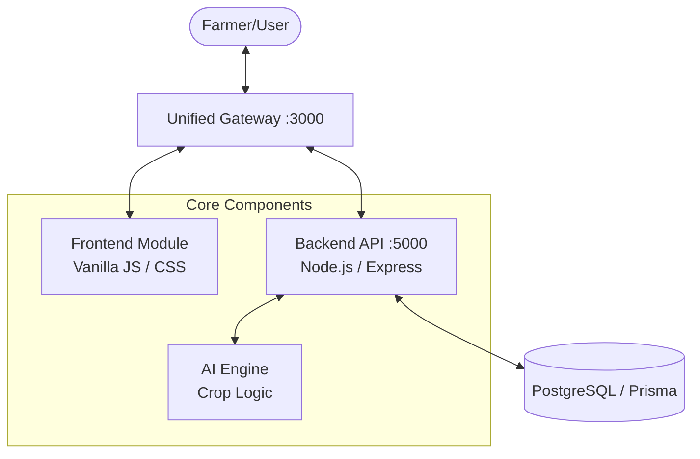

# 🌾 Farm Seeva - AI-Powered Agriculture Platform


> **Empowering Farmers with Data-Driven Insights.** 
> Farm Seeva is a production-ready, modular monorepo platform that leverages AI to provide precise crop recommendations based on soil health (Nitrogen, Phosphorus, Potassium).

---

## ✨ Features

- 🧠 **AI-Driven Recommendations**: Rule-based and ML-ready engine for crop selection.
- 🧪 **Soil Analysis**: Track N, P, K levels and receive actionable insights.
- 🌐 **Multi-Language Support**: Fully localized in English, Hindi, and Tamil.
- 🛡️ **Enterprise Security**: JWT authentication, rate limiting, and input validation.
- 🎨 **Premium UI/UX**: Modern glassmorphism design with 3D animations and responsive layouts.
- 🧱 **Clean Architecture**: Domain-driven design with clear separation of concerns.

---

## 🏗️ System Architecture



---

## 🛠️ Technology Stack

| Layer | Technologies |
| :--- | :--- |
| **Frontend** |    |
| **Backend** |    |
| **Database** |   |
| **Security** |   |
| **DevOps** |   |

---

## 📁 Repository Structure

```text
FarmSeeva/
├── 🌐 frontend/          # Vanilla JS Modular Application
│   ├── css/              # Premium Design System (Glassmorphism)
│   ├── i18n/             # Multilingual Support (en, hi, ta)
│   ├── js/               # API, Auth, Soil & Crop Logic
│   └── dashboard.html    # Core User Interface
├── ⚙️ backend/           # Robust REST API (TypeScript)
│   ├── src/modules/      # Auth, Soil, & Crop Domains
│   ├── middleware/       # Security & Validation
│   └── prisma/           # Data Modeling
├── 🧠 ai-engine/         # (Coming Soon) Advanced AI Models
├── 📱 mobile/            # (Coming Soon) Mobile Application
├── 🔗 shared/            # Cross-module Domain Types
└── 🌉 gateway.js         # Unified Proxy Server
```

---

## 🚀 Getting Started

### 1. Prerequisites
- [Node.js](https://nodejs.org/) (v18+)
- [Docker Desktop](https://www.docker.com/products/docker-desktop/)
- [PostgreSQL](https://www.postgresql.org/) (if not using Docker)

### 2. Setup Environment
```bash
cp .env.example .env
# Edit .env with your credentials
```

### 3. Initialize Database
```bash
# Start Docker containers
npm run docker:up

# Run migrations
npm run prisma:init
```

### 4. Start the Application
```bash
npm install
npm start
```
The application will be available at **[http://localhost:3000](http://localhost:3000)**.

---

## 📈 Roadmap

- [x] Responsive Dashboard & Soil Data Input
- [x] Multilingual Support (English, Hindi, Tamil)
- [x] Robust JWT Authentication
- [ ] Integration with Python AI Engine
- [ ] Mobile App Launch (iOS/Android)
- [ ] Real-time Weather Integration

---

Built with ❤️ by **Farm Seeva Team** for the future of farming.

