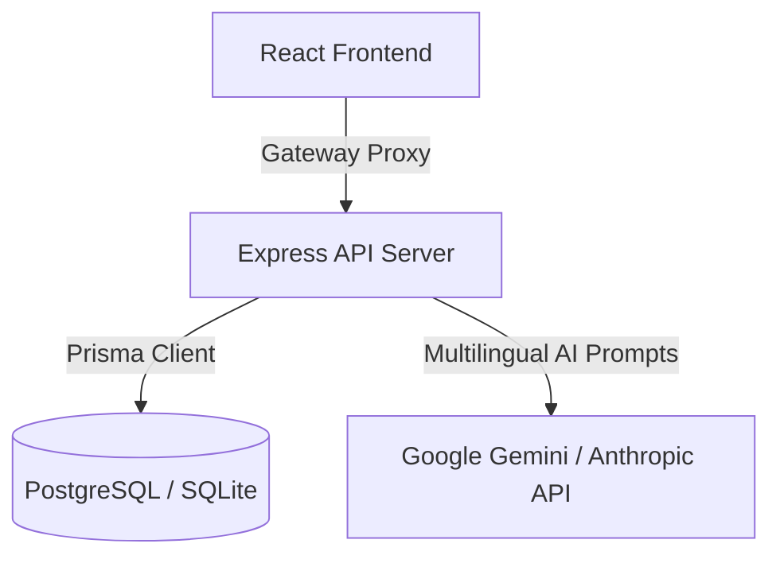

# System Architecture & Monorepo Configuration

This document outlines the monorepo workspace configurations, data schemas, and translation workflows inside Farm Seeva.

## Monorepo Layout

The repository is organized as a unified monorepo to coordinate backend and frontend developments:
- **`frontend/`**: The modern React-based user interface.
- **`frontend-legacy/`**: An older static multi-lingual user interface using localized file translations.
- **`backend/`**: A Node/Express REST API using Prisma for data modeling and access controls.
- **`shared/`**: Contains shared typescript interfaces ensuring type safety between backend responses and frontend client bindings.

## AI Telemetry Context Pipeline (Terra AI)

The core AI component **Terra AI** (`terraAIService`) runs on the backend to help farmers optimize crop yields:
1. **Telemetry Read**: Reads the farmer's latest soil reports (Nitrogen, Phosphorus, Potassium, pH) and location data.
2. **Context Assembly**: Computes the active season (Kharif, Rabi, Zaid) based on the current calendar month.
3. **API Prompt Routing**:
   - Asserts if a `GEMINI_API_KEY` is present to run the high-performance Gemini model.
   - Falls back to `CLAUDE_API_KEY` (Anthropic Claude model) if Gemini keys are absent.
   - Automatically returns data-aware offline recommendations if no internet connection or keys exist.
4. **Audit Trail Logging**: Stores all conversation history, farmer queries, and AI confidence estimates inside the SQL database.
